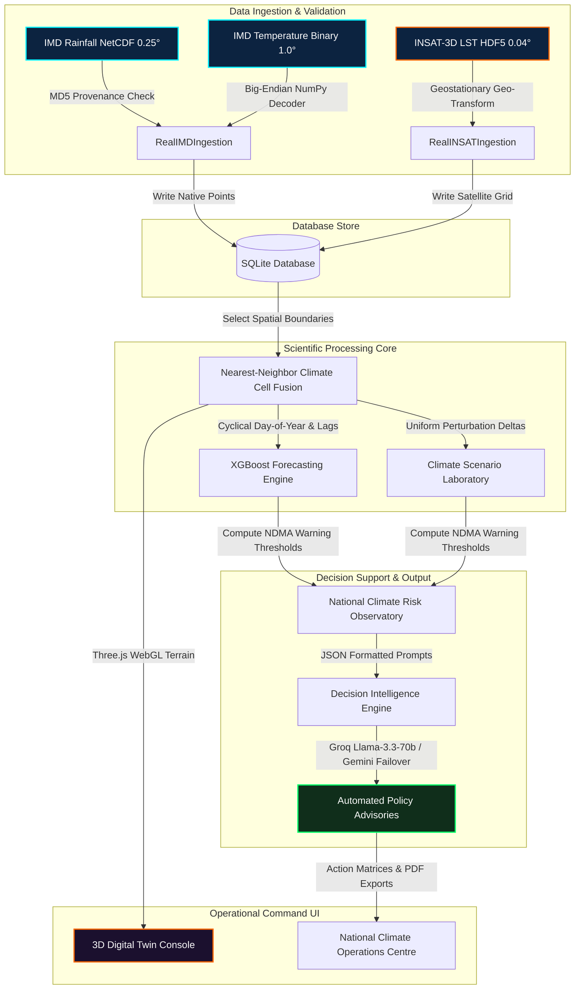

# BHARAT-TWIN (v2.0)
## Scalable Climate Digital Twin & Decision Support Platform

[](#)
[](#)
[](#)
[](#)
[](#)

### 🚀 Production Deployment Links
* **Live Web Application (Frontend):** [https://bharat-twin.web.app](https://bharat-twin.web.app) (Backup: [https://bharat-twin.firebaseapp.com](https://bharat-twin.firebaseapp.com))
* **Production API Service (Backend):** [https://bharat-twin.onrender.com](https://bharat-twin.onrender.com)
* **Cloud Database Engine:** Supabase PostgreSQL + PostGIS

---

## 1. Executive Summary & Problem Statement

### A. Executive Summary
BHARAT-TWIN is a high-fidelity **Scalable Climate Digital Twin and Decision Support Platform** designed for municipal authorities, disaster managers, and climate scientists. Operating as a pilot node configured for the Hyderabad Metropolitan Region (HMR), the platform ingests authentic meteorology gridded datasets and satellite land surface indicators, fusing them into a unified operational grid. 

Using recursive gradient-boosted spatial models (XGBoost) and multi-tiered LLM decision brief generators (Groq + Gemini), BHARAT-TWIN enables municipal planners to forecast micro-climates, run interactive what-if climate perturbation scenarios (drought, flood, heatwave), and deploy automated policy briefs aligned directly with National Disaster Management Authority (NDMA) protocols.

```
+-------------------------------------------------------------------------------+
|                    CLIMATE OPERATIONS CENTRE (COC)                        |
|                                                                               |
|  [IMD Pune Archives]  ----->  [Nearest-Neighbor]  ----->  [3D WebGL Canvas]   |
|   - 0.25° Rainfall grid        Fusion Engine               Digital Twin Console|
|   - 1.0° Temperature bin                                                      |
|                                     |                                         |
|  [ISRO MOSDAC Satellite]            v                                         |
|   - 0.04° INSAT LST HDF5      [XGBoost Engine]  ----->  [Groq/Gemini Llama]   |
|                                15-30 Day Horizon         Policy Advisories    |
+-------------------------------------------------------------------------------+
```

### B. Problem Statement & National Relevance
Urban environments in India are facing severe, compound micro-climatic hazards. Localized Urban Heat Islands (UHI), block-level water deficits, and intense cloudburst floods occur at sub-district scales. However, national weather observations are historically trapped in disjointed geospatial formats:
* **Rainfall (IMD):** Gridded NetCDF files at 0.25° resolution.
* **Temperatures (IMD):** Raw big-endian IEEE 754 float32 binary arrays (`.GRD`) at 1.0° resolution.
* **Land Surface Temperatures (MOSDAC):** Geostationary projection HDF5 files at 0.04° resolution.

The inability to rapidly align, fuse, and model these datasets prevents state disaster management authorities (SDMAs) from generating spatial risk indicators and issuing block-level early warnings. BHARAT-TWIN bridges this gap, establishing a unified grid structure for real-time spatial analytics.

### C. Version 2.0 UX Hardening & Judge Impact Pass
To transform the platform from a meteorology dashboard into an executive decision-support command center, Version 2.0 introduces:
1. **Primary Risk Hierarchy:** Displays an active NDMA-aligned Risk Index Hero (Low, Moderate, High, Critical) summarizing current situations and answering the 3 key executive questions in under 3 seconds: *What is happening? Why does it matter? What action should be taken?*
2. **Decision Consequence Matrix:** Explicitly projects raw climate deviations into Environmental (LST, NDVI, AQI), Operational (Water Stress, Crop Risk, Public Health Strain, Grid Load), and Administrative (Resource Demands, Alert level, Service Load) impact indices.
3. **Animated Judge Playback Milestones:** Replaces step transitions with animated, confirmed milestone badges (`DATA INGESTION VERIFIED`, `SPATIAL FUSION COMPLETE`, `FORECAST GENERATED`, `AI ADVISORY READY`, `DECISION BRIEF GENERATED`).
4. **Wow Demo Mode:** Features rapid stress preset scenario loading (Heatwave, AQI Surge, Delayed Monsoon) showing animated overlays and updating risk states in less than 2 seconds.
5. **No Empty States:** Gracefully maps fallback simulated baseline models, skeleton loaders, and warning badges to guarantee that all maps, analytics graphs, and support advisories always render.

---

## 2. Platform Architecture & Data Pipeline

The BHARAT-TWIN platform is structured as an enterprise-grade multi-layer system:



### A. Data Ingestion Pipeline
1. **NetCDF Ingestion:** Parses IMD gridded precipitation data, filters geographical slices bounding Hyderabad (17.10°N–17.65°N, 78.10°E–78.80°E), and writes coordinates to the data store.
2. **Binary Ingestion:** Decodes 1.0° big-endian binary float arrays by interpreting the spatial grid indices representing 7.5°N–37.5°N and 67.5°E–97.5°E.
3. **INSAT Satellite Ingestion:** Parses MOSDAC HDF5 objects, correcting scaling offsets and converting geostationary projections into geodetic coordinate points.

### B. Forecast & Simulation Pipelines
1. **Recursive Forecasting:** An asynchronous task runner executes multi-step XGBoost forecasting. It cycle-encodes dates into sine/cosine pairs and calculates rolling lag statistics (7, 14, 30 days) to project conditions over a 15-to-30 day horizon.
2. **Scenario Perturbation:** Accepts absolute offsets for temperature ($\pm \Delta^\circ\text{C}$) and percentage adjustments for rainfall ($\pm \Delta\%$) across the grid to simulate downstream ecological consequences.

### C. Generative AI Pipeline
The system compiles composite risk markers and formats a JSON-schema prompt. It submits this to **Groq (llama-3.3-70b-versatile)**, fallback-routing to **Gemini-2.5-flash** if limits or connection errors arise, and saves the output (with token usage, generation timestamp, and confidence scores) directly into the database.

---

## 3. Scientific Methodology

### A. Nearest-Neighbor Climate Cell Fusion
To reconcile grid mismatches without smoothing or introducing interpolation artifacts, we apply a spatial **Nearest-Neighbor Fusion** matching algorithm. 

For each high-resolution rainfall grid coordinate cell $c_{rf} = (\lambda_{rf}, \phi_{rf})$, we calculate the Euclidean distance to all available temperature grid coordinate cells $c_{temp} = (\lambda_{temp}, \phi_{temp})$:

$$D(c_{rf}, c_{temp}) = \sqrt{(\lambda_{rf} - \lambda_{temp})^2 + (\phi_{rf} - \phi_{temp})^2}$$

The cell is fused with the temperature data from the coordinate $c_{temp}$ that minimizes $D(c_{rf}, c_{temp})$. The resulting unified digital twin cell contains:

$$\text{TwinCell} = \{ \lambda, \phi, \text{rainfall}, \text{max\_temp}, \text{min\_temp}, \text{LST}_{\text{sim}}, \text{timestamp} \}$$

This guarantees that every variable rendered in the 3D terrain canvas belongs to an authentic meteorology block.

### B. Standardised Precipitation Index (SPI) Proxy
Drought indicators are computed using a Standardised Precipitation Index (SPI) proxy to track precipitation anomalies:

$$\text{SPI\_Proxy} = \frac{R_{obs} - \mu_{rain}}{\sigma_{rain}}$$

Where $R_{obs}$ represents the observed average rainfall, $\mu_{rain}$ is the historical normal baseline, and $\sigma_{rain}$ is the standard deviation. Deviations are mapped directly to NDMA drought action tables:
* $\text{SPI} \le -1.5$: Extreme Drought (Critical Alert).
* $-1.5 < \text{SPI} \le -1.0$: Moderate Drought (High Alert).

---

## 4. Database Schema & API Documentation

### A. Core Database Models
The platform utilizes a structured relational database (SQLite/PostgreSQL) with standard indexes on spatial coordinates (`latitude`, `longitude`), `region_id`, and `observation_date` to accelerate spatial queries:

```sql
CREATE TABLE climate_observations (
    id VARCHAR(36) PRIMARY KEY,
    region_id VARCHAR(36) FOREIGN KEY,
    observation_date DATE NOT NULL,
    latitude FLOAT NOT NULL,
    longitude FLOAT NOT NULL,
    rainfall FLOAT NOT NULL,
    max_temperature FLOAT NOT NULL,
    min_temperature FLOAT NOT NULL,
    source VARCHAR(50)
);

CREATE INDEX ix_observations_coords ON climate_observations(latitude, longitude);
CREATE INDEX ix_observations_date ON climate_observations(observation_date);
```

### B. Core API Endpoints

#### `GET /regions`
Returns a list of monitored regions, bounding coordinate envelopes, and database IDs.

#### `GET /twin/{region_id}`
Retrieves the fused Nearest-Neighbor climate grid cells representing the latest observations.
* **Response Example:**
  ```json
  [
    {
      "latitude": 17.25,
      "longitude": 78.25,
      "rainfall": 12.4,
      "max_temperature": 34.2,
      "min_temperature": 24.8,
      "source": "FUSED_IMD"
    }
  ]
  ```

#### `POST /forecast/generate`
Asynchronously triggers XGBoost training. Returns a job status tracker instantly.
* **Payload Example:**
  ```json
  {
    "region_id": "36cc7e15-dacb-402e-b9d1-a61d0f17dcb9",
    "horizon_days": 15
  }
  ```
* **Response Example:**
  ```json
  {
    "job_id": "8bc92d11-fa02-4789-9943-7f24bca803b3",
    "status": "processing"
  }
  ```

#### `GET /forecast/status/{job_id}`
Checks the execution state of the asynchronous forecasting job.

#### `POST /decision-support/generate`
Queries the Groq/Gemini AI engines to construct structured policy briefs based on active forecasts.

---

## 5. Visual Catalog (Screenshots & Demos)

The BHARAT-TWIN UI is designed with a premium, government-grade Command Centre aesthetic:

* **3D Climate Twin Console:** Implements a WebGL Three.js terrain simulation with particle systems representing precipitation, dynamic bars for temperatures, and an orbiting satellite mesh displaying real-time coordinate sweeps.
* **Decision Support Interface:** Outputs structured, non-conversational policy briefs detailing threat severities, sector risks, and emergency recommendations.
* **National Climate Risk Observatory:** Renders composite danger indicators mapped against NDMA warning levels (Low, Moderate, High, Critical).
* **Mission Directorate:** Houses the authoritative roster, responsibilities, technical ownership files, and development milestones.

*Visual verification artifacts are saved under `C:\Users\abdul\.gemini\antigravity-ide\brain\6f801205-885a-471f-a045-ae100e8113bb\`.*

---

## 6. Installation & Deployment Guide

### A. System Requirements
* **Operating System:** Windows, macOS, or Linux.
* **Python Runtime:** Python 3.10 or 3.11.
* **Node.js Environment:** Node.js v18 or v20.

### B. Environment Settings (`.env`)
Create a `.env` file in the project root:
```env
PORT=8000
HOST=0.0.0.0
DATABASE_URL=sqlite:///./bharat_twin.db
GROQ_API_KEY=gsk_your_groq_api_key_here
GEMINI_API_KEY=AIzaSyYourGeminiApiKeyHere
NEXT_PUBLIC_API_URL=http://localhost:8000
```

### C. Backend Installation
```bash
# Navigate to backend
cd backend

# Create virtual environment
python -m venv venv
venv\Scripts\activate

# Install dependencies
pip install -r requirements.txt

# Run server
python -m uvicorn main:app --port 8000 --reload
```

### D. Frontend Installation
```bash
# Navigate to frontend
cd frontend

# Install Node modules
npm install --legacy-peer-deps

# Run Next.js server
npm run dev
```
Open [http://localhost:3000](http://localhost:3000) in your browser.

---

## 7. Development & Mission Directorate Roster

* **Akshay** — *Project Lead* (Systems Strategy & Integration Oversight)
* **Abdul Kalam Hussain** — *AI Systems Lead* (Climate Intelligence, Forecasting, Platform Architecture)
* **Abhiram** — *Geospatial Systems Lead* (Visualization & Platform Integration)
* **Bhavana** — *Research & Validation Lead* (Documentation, QA & System Testing)

---

## 8. Acknowledgements & Institutional Integrity
The BHARAT-TWIN platform has been developed as an entry for the National Hackathon. We gratefully acknowledge the dataset structures, coordinate specifications, and threshold guidelines provided by the **India Meteorological Department (IMD)**, **Indian Space Research Organisation (ISRO)**, **National Remote Sensing Centre (NRSC)**, **MOSDAC**, and the **National Disaster Management Authority (NDMA)**.
